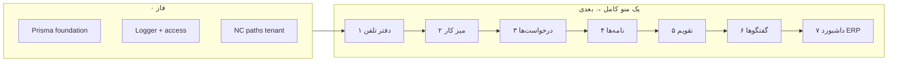

# NexaApp — TODO v10 (Meizito · دسترسی سریع · PostgreSQL · Nextcloud · بدون mock)

**تاریخ:** ۱۴۰۵/۰۳/۱۹  
**پایه انجام‌شده:** [`todo-v9.md`](todo-v9.md) — `Business`, `BusinessMember`, tenant حداقلی، auth/session، Nextcloud env  
**هدف v10:** ماژول **دسترسی سریع (Meizito)** — UI موجود بدون تغییر ظاهری — **داده واقعی DB** — حذف mock/localStorage — یکپارچگی Nextcloud tenant-aware

> **قانون طلایی v10:** **یک منو = یک فاز = ۱۰۰٪ تمام → smoke → build → migrate deploy → تیک در todo → بعد منوی بعدی.**  
> **⛔ هیچ فاز بعدی شروع نشود تا DoD فاز جاری سبز نباشد.**  
> **قانون UI:** بدون تغییر layout/استایل/متن panel — فقط wiring `MeizitoContext` → API.  
> **داشبورد ERP:** **آخرین فاز (۷)** — aggregate از DB.

---

## وضعیت فعلی (قبل از v10)

| منو (دسترسی سریع) | Route | Panel / View | Backend |
|-------------------|-------|--------------|---------|
| **میز کار** | `/dashboard/tasks` | `MeizitoWorkspace` (چند tab) | **DB ✅ فاز ۲** |
| **تقویم** | `/dashboard/tasks?tab=calendar` | `CalendarPanel` | **DB ✅ فاز ۵** |
| **گفتگوها** | `/dashboard/chats` | `MeizitoChatEmbed` | **DB ✅ فاز ۶** |
| **درخواست‌ها** | `/dashboard/work-requests` | `RequestsPanel` | **DB ✅ فاز ۳** |
| **نامه‌ها** | `/dashboard/tasks?tab=letters` | `LettersPanel` | **DB ✅ فاز ۴** |
| **دفتر تلفن** | `/dashboard/tasks?tab=phone` | `PhoneDirectoryPanel` | **DB ✅ فاز ۱** |
| **داشبورد ERP** | `/dashboard/dashboard` | ERP views | mock — **آخر** |

| بخش | فایل | مشکل |
|-----|------|------|
| Hub داده | `MeizitoContext.tsx` | `seedData()` · `localStorage` کلید `nexa-meizito-v2` |
| Mock users | `src/types/meizito.ts` | `MEIZITO_MOCK_USERS` (۵ کاربر فیک) |
| User switcher | `MeizitoWorkspace` | `nexa-meizito-current-user-id` — نه session |
| Prisma | `schema.prisma` | **مدل Meizito ندارد** |
| Nextcloud | `src/lib/nextcloud/paths.ts` | مسیرها **بدون** `businessId` |
| API | `app/api/` | **بدون** `app/api/meizito/*` |
| Tenant | v9 `Business` | Meizito به `businessId` وصل نیست |

**فایل‌های کلیدی:**

```
src/context/MeizitoContext.tsx     ← mock hub (refactor تدریجی)
src/types/meizito.ts               ← types UI (ثابت می‌ماند)
src/views/meizito/panels/*         ← panels (بدون تغییر UI)
src/lib/meizito/approval.ts        ← logic client (port به server)
src/lib/meizito/teamHierarchy.ts
src/lib/nextcloud/paths.ts         ← tenant paths در فاز ۰
src/lib/business/access.ts         ← الگوی requireBusinessAccess
app/api/businesses/*               ← الگوی API
```

---

## قرارداد اسکوپ v10

| داخل v10 | خارج از v10 |
|----------|-------------|
| Backend + DB برای منوهای دسترسی سریع | redesign UI/UX Meizito |
| Wiring `MeizitoContext` → API | tenant isolation در **همه** ماژول‌های ERP (غیر Meizito) |
| حذف mock/localStorage per منو (پس از تکمیل فاز) | chat voice realtime / WebRTC |
| Nextcloud path per business: `/Nexa/{businessId}/...` | multi-file NC versioning |
| Logging + audit برای mutations | enterprise SSO |
| Smoke script per فاز | billing / invite member به business |
| داشبورد ERP از DB (فاز ۷) | super_admin cross-tenant dashboard |

---

## قوانین پیاده‌سازی

| قانون | توضیح |
|--------|--------|
| **یک منو کامل → بعدی** | DoD فاز N قبل از شروع فاز N+1 |
| **UI ثابت** | panels دست نخورند — فقط context wiring |
| **mock صفر** | پس از هر فاز، slice مربوطه از `seedData()` حذف |
| **tenant** | همه query با `businessId` + `requireBusinessAccess` |
| **user واقعی** | `currentUserId` = session `User.id` |
| **Nextcloud** | upload/list فقط زیر `/Nexa/{businessId}/` |
| **لاگ** | `createLogger('meizito/...')` + `writeAuditLog` برای mutation |
| **نام‌گذاری** | `WorkspaceProject` ≠ `AccountingProject` (v9) |

---

## ترتیب پیاده‌سازی (پیشنهاد فنی)

ترتیب sidebar ≠ ترتیب پیاده‌سازی. **دفتر تلفن اول** است چون approval، referral و assignee به لیست اعضای business وابسته‌اند.

| فاز | منو | Route |
|-----|-----|-------|
| **۰** | زیرساخت مشترک | — |
| **۱** | **دفتر تلفن** | `?tab=phone` |
| **۲** | **میز کار** | `/dashboard/tasks` (tabهای workspace) |
| **۳** | **درخواست‌ها** | `/dashboard/work-requests` |
| **۴** | **نامه‌ها** | `?tab=letters` |
| **۵** | **تقویم** | `?tab=calendar` |
| **۶** | **گفتگوها** | `/dashboard/chats` |
| **۷** | **داشبورد ERP** | `/dashboard/dashboard` — **آخر** |
| **۸** | QA · Deploy · پاکسازی نهایی | — |

---

## Prisma — sketch یکپارچه (migration تدریجی per فاز)

```
BusinessMemberProfile     ← فاز ۰/۱ (1:1 BusinessMember)
  jobTitle, department, mobile, extension, managerUserId?

WorkspaceBoard            businessId, name, description?, sortOrder, createdById
WorkspaceColumn           boardId, title, order
WorkspaceCard             boardId, columnId, title, assigneeUserId?, dueDate?,
                          starred, checklist Json, labels Json, attachments Json

WorkspaceProject          businessId, name, boardId?, ncFolderPath?  ← ≠ AccountingProject
WorkspaceProjectMember    projectId, userId

NoteBoard                 businessId, name
WorkspaceNote             businessId, boardId, title, body, starred, archived, ncAttachments Json

InternalRequest           businessId, title, body, priority, category,
                          referrals Json, approval Json, attachments Json
InternalLetter            businessId, box, category, threadId, replyToId?, body,
                          approval Json, attachments Json

DailyReport               businessId, authorUserId, dateKey, status, content Json, feedback Json
FieldVisit                businessId, authorUserId, visitDate, details Json

MeizitoCalendar           businessId, name, color?, sharedWith Json
CalendarEvent             calendarId, title, start, end, allDay, rsvp Json, sourceCardId?

ChatThread                businessId, type, title?, memberIds Json, starred, pinned
ChatMessage               threadId, authorUserId, type, body, attachmentRefs Json

ApprovalStep              businessId, entityType, entityId, action, actorUserId,
                          assigneeUserId?, meta Json, createdAt
```

**Enums مشترک:** `MeizitoApprovalState`, `MeizitoApprovalAction`, `LetterBox`, `InternalRequestPriority`, ...

---

## ساختار فایل‌های هدف

```
prisma/
  schema.prisma
  migrations/…_meizito_v10_foundation/
  migrations/…_meizito_phone_v10/
  migrations/…_meizito_workspace_v10/
  …

src/lib/meizito/
  access.ts              ← requireMeizitoAccess(req, businessId)
  serialize.ts           ← DB → Meizito TS types
  approval-server.ts     ← port approval.ts
  team-server.ts         ← port teamHierarchy.ts
  client.ts              ← fetch wrappers
  paths.ts               ← ncPathFor*(businessId, …)
  audit.ts               ← writeAuditLog prefix meizito.*

app/api/meizito/[businessId]/
  team-directory/route.ts
  boards/ …
  cards/ …
  requests/ …
  letters/ …
  calendars/ …
  calendar-events/ …
  chat/threads/ …
  daily-reports/ …
  field-visits/ …
  notes/ …
  note-boards/ …
  pending-approvals/route.ts

scripts/
  meizito-smoke-foundation.ts
  meizito-smoke-phone.ts
  meizito-smoke-workspace.ts
  meizito-smoke-requests.ts
  meizito-smoke-letters.ts
  meizito-smoke-calendar.ts
  meizito-smoke-chat.ts
```

---

# فاز ۰ — زیرساخت یکپارچه

**هدف:** قرارداد مشترک قبل از اولین منو. **DoD:** migrate سبز + helperها + smoke foundation — UI هنوز mock.

### ۰.۱ Prisma — foundation

- [x] `BusinessMemberProfile` (یا فیلدهای روی `BusinessMember`)
- [x] enumهای approval مشترک
- [x] migration: `20260610_meizito_v10_foundation`

### ۰.۲ Lib مشترک

- [x] `src/lib/meizito/access.ts` — wrap `requireBusinessAccess`
- [x] `src/lib/meizito/serialize.ts` — stub
- [x] `src/lib/meizito/client.ts` — base fetch + error handling
- [x] `src/lib/meizito/audit.ts` — `logMeizitoAction(...)`

### ۰.۳ Nextcloud tenant paths

- [x] `src/lib/nextcloud/paths.ts` — اضافه `businessId` به همه مسیرهای meizito:

```
/Nexa/{businessId}/meizito/boards/{boardId}/cards/{cardId}/
/Nexa/{businessId}/meizito/letters/{letterId}/
/Nexa/{businessId}/meizito/letters/drafts/
/Nexa/{businessId}/meizito/requests/
/Nexa/{businessId}/meizito/notes/
/Nexa/{businessId}/meizito/chat/{threadId}/
/Nexa/{businessId}/projects/{projectId}/
```

- [x] `app/api/nextcloud/upload` + `list` — validate path زیر `/Nexa/{businessId}/` + membership
- [x] `createLogger('nextcloud')` در routes NC

### ۰.۴ Logging

- [x] `createLogger('meizito')` — submodule: `meizito/boards`, `meizito/letters`, ...
- [x] الگو: `log.info('op', { businessId, entityId, userId })` — `maskUsername` برای PII

### ۰.۵ MeizitoContext — آماده‌سازی (mock باقی)

- [x] `useBusiness()` — `activeBusinessId` برای fetch
- [x] `useAuth()` — `currentUserId` از session
- [x] flag داخلی `dataSource: 'mock' | 'api'` per slice
- [x] mock user switcher: disable وقتی API فعال

### ۰.۶ Scripts

- [x] `scripts/meizito-smoke-foundation.ts`
- [x] `npm run test:meizito:foundation` در package.json

**✅ DoD فاز ۰:** migrate · build سبز · smoke foundation · NC paths آماده · logger در NC

---

# فاز ۱ — منو: **دفتر تلفن**

**Route:** `/dashboard/tasks?tab=phone`  
**Panel:** `PhoneDirectoryPanel` → `listTeamDirectory()`

> **⛔ فاز ۲ (میز کار) شروع نشود تا همه تیک‌ها و DoD سبز باشد.**

### ۱.۱ Prisma

- [x] `BusinessMemberProfile` کامل — migration `…_meizito_phone_v10`

### ۱.۲ API

- [x] `GET /api/meizito/[businessId]/team-directory?filter=&q=`
- [x] `PATCH /api/meizito/[businessId]/members/[userId]/profile` — owner/admin

### ۱.۳ Backend logic

- [x] `listTeamDirectory` server-side — port از `src/lib/meizito/approval.ts`
- [x] `managerUserId` chain · map role به `member|manager|senior_manager`
- [x] serialize → شکل `MeizitoMockUser` (UI بدون تغییر)

### ۱.۴ Context wiring

- [x] `listTeamDirectory` → fetch API
- [x] `mockUsers` = cache API (نام متغیر برای سازگاری type)
- [x] حذف import `MEIZITO_MOCK_USERS` از runtime

### ۱.۵ حذف mock

- [x] `seedData()` — بدون mock users
- [ ] (اختیاری) seed DB profile برای bootstrap user

### ۱.۶ Logging

- [x] `log.info('team-directory.list', { businessId, filter, resultCount })`

### ۱.۷ Smoke

- [x] `scripts/meizito-smoke-phone.ts`
- [x] `npm run test:meizito:phone`

**✅ DoD فاز ۱:** PhoneDirectoryPanel همان UI · داده DB · reload ماندگار · mock users صفر · smoke سبز

---

# فاز ۲ — منو: **میز کار**

**Route:** `/dashboard/tasks`  
**شامل tabها:** dashboard، boards، projects، reports، notes، starred، monitoring، boardInfo  
**خارج از این فاز:** calendar، letters، phone (فاز ۱)، chats، work-requests

> **⛔ فاز ۳ شروع نشود تا میز کار ۱۰۰٪ تمام شود.**

### ۲.۱ Prisma + migrate

- [x] `WorkspaceBoard`, `WorkspaceColumn`, `WorkspaceCard`
- [x] `WorkspaceProject`, `WorkspaceProjectMember`
- [x] `NoteBoard`, `WorkspaceNote`
- [x] `DailyReport`, `FieldVisit`
- [x] migration: `…_meizito_workspace_v10`

### ۲.۲ API — Kanban

- [x] `GET/POST .../boards` · `PATCH .../boards/[id]`
- [x] `GET/POST .../boards/[id]/columns`
- [x] `GET/POST .../cards` · `PATCH/DELETE .../cards/[id]`
- [x] `POST .../card-move`
- [x] `GET .../card-search?boardId=&q=`

### ۲.۳ API — Projects / Notes / Reports

- [x] Projects CRUD + default `ncFolderPath`
- [x] Note boards + notes CRUD · star · archive
- [x] Daily reports CRUD · submit · feedback · approve
- [x] Field visits CRUD

### ۲.۴ Nextcloud

- [x] card attachments — path با `businessId`
- [x] note `ncAttachments`
- [x] project folder — `NcFolderLinkButton` path جدید

### ۲.۵ Context wiring (بدون تغییر UI)

| Panel | wiring |
|-------|--------|
| `BoardsPanel` | boards/columns/cards CRUD + move |
| `ProjectsPanel` | projects API (+ members از team-directory) |
| `NotesPanel` | noteBoards/notes API |
| `ReportsPanel` | dailyReports/fieldVisits API |
| `DashboardPanel` | read queries (due/overdue/reports/visits) |
| `StarredPanel` | star flags cards/notes |
| `MonitoringPanel` | aggregate columns/cards |
| `BoardInfoPanel` | PATCH board |

### ۲.۶ حذف mock

- [x] حذف seed boards/columns/cards/projects/notes/reports/visits
- [ ] `assigneeUserId` در DB · displayName در serialize برای UI

### ۲.۷ Logging

- [x] card move/create · report submit/approve · visit create → log + audit

### ۲.۸ Smoke

- [x] `scripts/meizito-smoke-workspace.ts`
- [x] `npm run test:meizito:workspace`

**✅ DoD فاز ۲:** tabهای workspace بالا کاملاً DB · بدون localStorage entity · NC tenant · smoke سبز

---

# فاز ۳ — منو: **درخواست‌ها**

**Route:** `/dashboard/work-requests`  
**Panel:** `RequestsPanel` · approval · referrals (max 3)

> **⛔ فاز ۴ شروع نشود تا DoD سبز.**

### ۳.۱ Prisma

- [x] `InternalRequest` · `ApprovalStep`

### ۳.۲ API

- [x] `GET/POST .../requests`
- [x] `PATCH .../request-update` — close/reopen
- [x] `POST .../request-approval` — submit/approve/reject/forward/cancel/comment
- [x] `GET .../pending-approvals`

### ۳.۳ Wiring

- [x] `RequestsPanel` · `CommsHubPanel` (requests)
- [x] `MeizitoChatEmbed.addInternalRequest` → API
- [x] referrals از team-directory (فاز ۱)

### ۳.۴ Nextcloud

- [ ] `/Nexa/{businessId}/meizito/requests/` — attachments

### ۳.۵ حذف mock · Logging · Smoke

- [x] seed `internalRequests` حذف
- [x] `scripts/meizito-smoke-requests.ts` · `npm run test:meizito:requests`

**✅ DoD فاز ۳:** CRUD + approval end-to-end · mock صفر

---

# فاز ۴ — منو: **نامه‌ها**

**Route:** `/dashboard/tasks?tab=letters`  
**Panel:** `LettersPanel` · thread · inbox/outbox/archive

> **⛔ فاز ۵ شروع نشود تا DoD سبز.**

### ۴.۱ Prisma

- [x] `InternalLetter` · reuse `ApprovalStep`

### ۴.۲ API

- [x] `GET/POST .../letters` · filter by box
- [x] `POST .../letter-reply`
- [x] `PATCH .../letter-update` — box/status/close/reopen
- [x] `POST .../letter-approval`

### ۴.۳ Wiring

- [x] `LettersPanel` · badge count در `MeizitoWorkspace`
- [x] `CommsHubPanel` (letters)

### ۴.۴ Nextcloud

- [ ] drafts: `.../letters/drafts/` · per-letter: `.../letters/{id}/`

### ۴.۵ حذف mock · Logging · Smoke

- [x] seed letters حذف
- [x] `scripts/meizito-smoke-letters.ts` · `npm run test:meizito:letters`

**✅ DoD فاز ۴:** thread + approval + attachments · mock صفر

---

# فاز ۵ — منو: **تقویم**

**Route:** `/dashboard/tasks?tab=calendar`  
**Panel:** `CalendarPanel` · sync از cards

> **⛔ فاز ۶ شروع نشود تا DoD سبز.**

### ۵.۱ Prisma

- [x] `MeizitoCalendar`, `CalendarEvent`

### ۵.۲ API

- [x] calendars CRUD · events CRUD
- [x] `POST .../calendar-events-sync-from-cards`
- [x] `PATCH .../calendar-event-rsvp`

### ۵.۳ Wiring

- [x] `CalendarPanel` · `CommsHubPanel` (events today)
- [x] `FieldVisitModal` → `addCalendarEvent` API

### ۵.۴ حذف mock · Smoke

- [x] seed calendars/events حذف
- [x] `scripts/meizito-smoke-calendar.ts` · `npm run test:meizito:calendar`

**✅ DoD فاز ۵:** تقویم + sync due dates · mock صفر

---

# فاز ۶ — منو: **گفتگوها**

**Route:** `/dashboard/chats`  
**Panel:** `MeizitoChatEmbed`

> **⛔ فاز ۷ شروع نشود تا DoD سبز.**

### ۶.۱ Prisma

- [x] `ChatThread`, `ChatMessage`

### ۶.۲ API

- [x] threads CRUD · messages GET/POST/PATCH
- [x] star/pin thread
- [x] `createCardFromText` → cards API (فاز ۲)

### ۶.۳ Nextcloud

- [x] file/image upload — `attachmentRefs` (تصویر از NC، بدون `imageDataUrl` در DB)
- [ ] voice: upload NC — **defer** (TODO در `MeizitoChatEmbed`)

### ۶.۴ Wiring

- [x] `ChatsPage` · comms tab redirect

### ۶.۵ Smoke

- [x] `scripts/meizito-smoke-chat.ts` · `npm run test:meizito:chat`

**✅ DoD فاز ۶:** messaging + file via NC · mock صفر

---

# فاز ۷ — **داشبورد ERP** (آخر)

**Route:** `/dashboard/dashboard`  
**هدف:** aggregate از DB tenant-scoped — **نه** Meizito mock

- [ ] بررسی views ERP موجود — چه KPI/mock دارد
- [ ] `GET /api/dashboard/[businessId]/summary`
- [ ] wiring views — **بدون redesign**
- [ ] حذف mock ERP dashboard

**✅ DoD فاز ۷:** dashboard از DB · Meizito قبلاً DB (فاز ۱–۶)

---

# فاز ۸ — QA · Deploy · پاکسازی نهایی

### ۸.۱ Automated

- [ ] `npm run test:auth` + همه `test:meizito:*` — سبز
- [ ] `npm run build` — سبز

### ۸.۲ MeizitoContext نهایی

- [ ] حذف کامل `seedData()` · `STORAGE_KEY` · `nexa-meizito-v1/v2`
- [ ] حذف `MEIZITO_MOCK_USERS` از production runtime
- [ ] `MeizitoProvider` فقط API + cache

### ۸.۳ Production (Coolify + Nextcloud)

- [ ] push · redeploy · `migrate deploy`
- [ ] verify `NEXTCLOUD_*` · `/api/nextcloud/status` → configured
- [ ] smoke production: login → business → هر منو
- [ ] `LOG_LEVEL=info` — بررسی لاگ Coolify

**✅ DoD v10:** دسترسی سریع ۱۰۰٪ DB · localStorage Meizito صفر · NC tenant paths

---

## چک‌لیست «آیا می‌توانم بروم فاز بعد؟»

- [ ] همه APIهای فاز با smoke script سبز
- [ ] slice مربوطه از `seedData()` حذف شده
- [ ] reload — داده از DB
- [ ] user دیگر business — 403 / داده جدا
- [ ] NC upload/list با path جدید کار می‌کند
- [ ] لاگ‌ها در console/Coolify قابل ردیابی
- [ ] `npm run build` سبز
- [ ] تیک فاز در این فایل

---

## برآورد زمان

| فاز | منو | تخمین |
|-----|-----|--------|
| ۰ | زیرساخت | 1–1.5 روز |
| ۱ | دفتر تلفن | 0.5–1 روز |
| ۲ | **میز کار** | 3–5 روز |
| ۳ | درخواست‌ها | 1.5–2 روز |
| ۴ | نامه‌ها | 1.5–2 روز |
| ۵ | تقویم | 1–1.5 روز |
| ۶ | گفتگوها | 2–3 روز |
| ۷ | داشبورد ERP | 2–4 روز |
| ۸ | QA/Deploy | 0.5–1 روز |
| **جمع** | | **~۱۳–۲۰ روز** |

---

## دیاگرام جریان



---

## یادداشت اجرا

- **Sequential اجباری:** فاز N → DoD → (commit اگر کاربر خواست) → فاز N+1
- **فرانت:** فقط `MeizitoContext` + client fetch — panels دست نخورند
- **Migration:** هر فاز migration جدا
- **الگوی API:** همان `requireSessionUser` + `requireBusinessAccess` + `jsonOk`
- **Catalog `people` در ProjectsPanel:** map به `BusinessMember` (ترجیح) یا نگه‌داشتن catalog — تصمیم در فاز ۲
- **Production:** tsconfig fix (`scripts/**` exclude) — push/redeploy قبل از v10 production smoke

**آخرین بروز:** ۱۴۰۵/۰۳/۱۹ · **وضعیت:** فاز ۰–۶ ✅ · فاز ۷ ⬜ (داشبورد ERP)

> **پس از pull:** `npx prisma migrate deploy` · `npm run test:auth` · smoke فاز جاری
